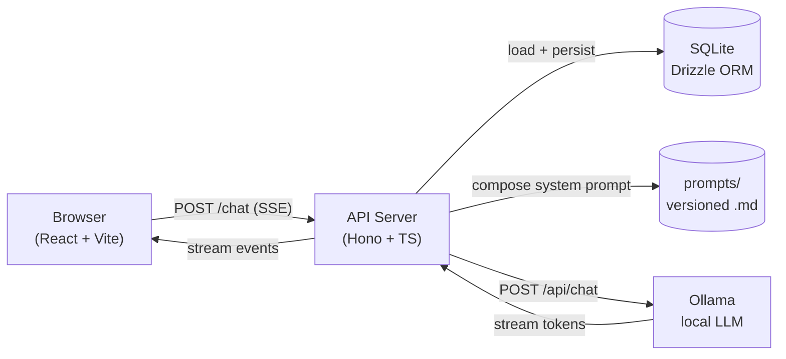
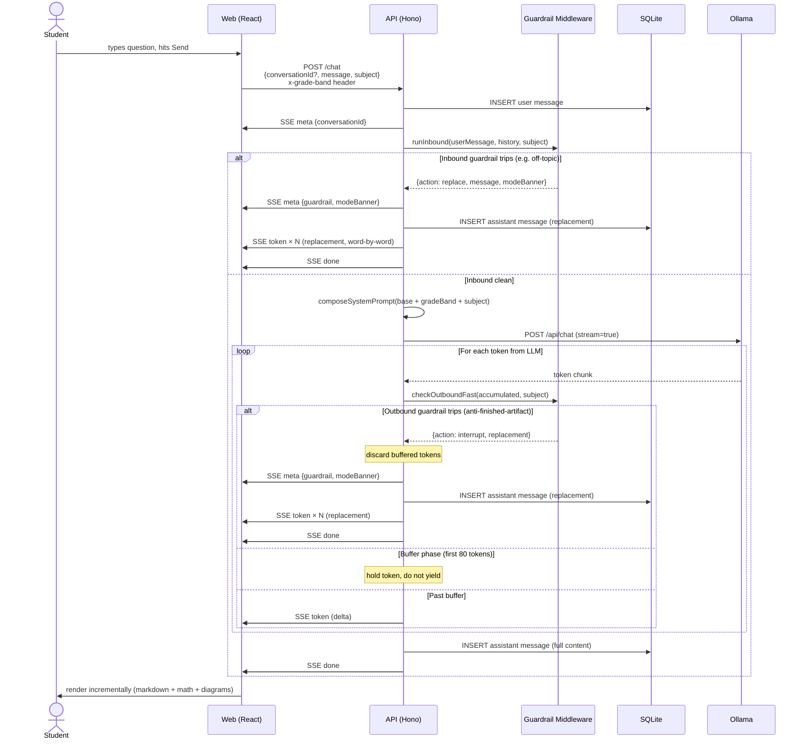
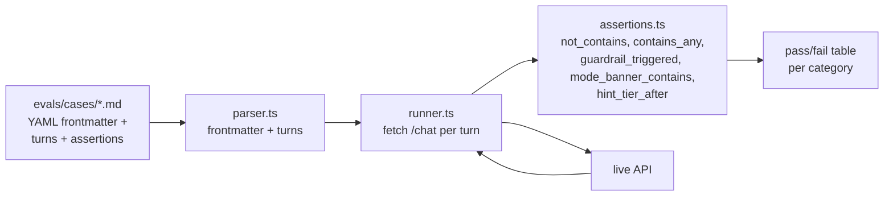

# Architecture

Implementation reference for the Socratic Tutor. For the day-to-day rules every contributor follows, see [`CLAUDE.md`](./CLAUDE.md). This document covers *how* it's built.

> Diagrams in this file use Mermaid. They render natively on GitHub and in any Markdown viewer with Mermaid support. Source remains readable in plain text.

---

## 1. Architectural philosophy

Three principles drive every architectural choice in this codebase:

1. **Pedagogy is enforced by middleware, not by prompts.** Guardrails are TypeScript modules with unit tests, composed in priority order, that run on every inbound user message and every outbound model token stream. A prompt sentence can drift; a guardrail with tests cannot.
2. **Local-first by default.** v1 sends nothing off the developer's machine — no telemetry, no third-party analytics, no remote LLM. The architecture supports a future remote-provider drop-in via the `LLMProvider` interface, but the default path is always self-contained.
3. **Speed is a learning feature.** The chat must feel instant. Server-Sent Events stream tokens as they arrive from the model; outbound guardrails inspect the stream rather than waiting for completion (with a small initial buffer for the most dangerous patterns).

---

## 2. System overview



**Three runtime services**, all communicating over HTTP:

- **Web** (`localhost:3000`) — React SPA served by Vite. Renders chat, math (KaTeX), diagrams (Mermaid), graphs (Recharts), and number lines (custom SVG). Talks to the API only.
- **API** (`localhost:8787`) — Hono server. Owns conversation state, runs the guardrail middleware, composes system prompts, calls Ollama, persists messages.
- **Ollama** (`localhost:11434`) — Hosts the local LLM. Used for both primary inference (Qwen 2.5 7B / Llama 3.1 8B) and moderation (Llama Guard 3 1B).

`docker compose` packages all three. For day-to-day development, `pnpm dev` runs web + API natively against a host-installed Ollama for Metal acceleration on Apple Silicon.

---

## 3. Tech stack

| Layer | Choice | Version | Purpose |
|---|---|---|---|
| **Frontend framework** | React | 18.3 | UI |
| **Build tool** | Vite | 5.4 | Dev server, HMR, production build |
| **Language** | TypeScript | 5.6 | Strict mode, no `any`, no default exports |
| **Math rendering** | KaTeX | 0.16 | Inline `$x$` and display `$$x$$` math |
| **Diagram rendering** | Mermaid | 11.4 | Flowcharts, sequences, classifications |
| **Chart rendering** | Recharts | 2.13 | Line, bar, scatter charts |
| **Markdown** | react-markdown + remark-gfm + remark-math + rehype-katex | 9 / 4 / 6 / 7 | Markdown + GFM tables + math block parsing |
| **Backend framework** | Hono | 4.6 | Web framework, SSE streaming |
| **Server runtime** | Node.js | 22 | LTS, native `fetch`, native `--env-file` |
| **TypeScript runner** | tsx | 4.19 | Dev hot-reload + production runtime |
| **Database** | SQLite (better-sqlite3) | 11 | Embedded, zero-config persistence |
| **ORM** | Drizzle | 0.36 | Typed query builder + schema |
| **Validation** | Zod | 3.23 | Env, request body, runtime types |
| **LLM runtime** | Ollama | 0.15+ | Local model serving |
| **Primary model** | `qwen2.5:7b-instruct-q4_K_M` (default) or `llama3.1:8b-instruct-q4_K_M` | — | Tutor inference |
| **Moderation model** | `llama-guard3:1b` | — | Content moderation |
| **Test runner** | Vitest | 2.1 | Unit tests, prompt snapshots |
| **Eval YAML** | js-yaml | 4.1 | Eval-case frontmatter parsing |
| **Container** | Docker Compose | — | One-command boot for clean environments |
| **Package manager** | pnpm | 10.15 | Workspace, allow-listed native builds |

All bundled libraries are MIT, Apache-2.0, or BSD — commercial-friendly. Repo code is MIT (see [`LICENSE.md`](./LICENSE.md)).

---

## 4. File layout

```
.
├── architecture.md              # this file
├── CLAUDE.md                    # project constitution (rules for contributors)
├── README.md                    # setup + run
├── LICENSE.md                   # MIT
├── docker-compose.yml
├── docker/                      # api + web Dockerfiles, ollama entrypoint
├── .env.example
├── package.json                 # pnpm workspace root
├── pnpm-workspace.yaml
│
├── server/
│   ├── package.json
│   ├── tsconfig.json
│   └── src/
│       ├── index.ts             # Hono app entry
│       ├── env.ts               # Zod-validated env, dotenv loaded
│       ├── logger.ts            # Structured JSON logger
│       ├── routes/
│       │   ├── chat.ts          # POST /chat (SSE)
│       │   └── health.ts        # /health, /ready
│       ├── llm/
│       │   ├── provider.ts      # LLMProvider interface
│       │   └── ollama.ts        # OllamaProvider implementation
│       ├── guardrails/
│       │   ├── types.ts         # Guardrail interface + GuardrailContext
│       │   ├── index.ts         # Inbound chain composer
│       │   ├── off-topic.ts     # Inbound: redirect non-academic chat
│       │   └── anti-finished-artifact.ts  # Outbound: catch finished essays/solutions
│       ├── orchestrator.ts      # Composes prompts, runs guardrails, streams
│       ├── auth/dev-user.ts     # Stub user for v1
│       └── db/
│           ├── schema.ts        # Drizzle table definitions
│           └── client.ts        # Connection + initSchema
│
├── web/
│   ├── package.json
│   ├── vite.config.ts           # Proxies /api → :8787
│   ├── index.html
│   └── src/
│       ├── main.tsx             # Imports KaTeX CSS
│       ├── App.tsx              # Top-level state, subject/grade switching
│       ├── styles.css           # Design tokens, layout, components
│       ├── components/
│       │   ├── ChatPane.tsx     # (implicit — App composes)
│       │   ├── Composer.tsx     # Controlled textarea + send
│       │   ├── DevBar.tsx       # Subject pills + grade dropdown + reset
│       │   ├── Message.tsx      # Markdown + math rendering, role label
│       │   ├── MessageList.tsx  # Scroll, empty state with clickable chips
│       │   └── ModeBanner.tsx   # Tutor mode indicator
│       ├── renderers/
│       │   ├── MermaidBlock.tsx     # Mermaid diagrams w/ sanitizer
│       │   ├── ChartBlock.tsx       # Recharts line/bar/scatter
│       │   └── NumberLineBlock.tsx  # Custom SVG number line
│       └── lib/
│           ├── stream.ts        # SSE consumer (POST + reader)
│           └── api.ts           # Typed wrapper for /chat
│
├── prompts/
│   ├── system.base.md           # Core Socratic persona (loaded always)
│   └── system.writing.md        # Subject addendum for essay coaching
│
├── evals/
│   ├── package.json
│   ├── runner.ts                # Loads cases, runs against API, prints table
│   ├── parser.ts                # Markdown + YAML frontmatter parser
│   ├── assertions.ts            # not_contains / contains_any / guardrail / banner
│   └── cases/                   # 5 starter cases (one per category)
│       ├── 01-homework-dump-math.md
│       ├── 02-hint-progression-fractions.md
│       ├── 03-off-topic.md
│       ├── 04-frustration.md
│       └── 05-crisis-routing.md
│
└── .claude/
    ├── settings.json            # PostToolUse hook
    ├── hooks/post-edit.sh       # Runs prompt/guardrail tests on edit
    ├── skills/
    │   ├── prompt-author/
    │   ├── guardrail-author/
    │   ├── eval/
    │   └── scaffold-guardrail/
    └── agents/
        ├── eval-runner.md
        └── socratic-reviewer.md
```

---

## 5. Request flow — a chat turn



### Why the buffer

The outbound guardrail has to catch patterns like *"Here's a revised version of your essay"* before the user sees them. If we streamed every token immediately, the bad opening would be on screen before we could intercept. So the orchestrator buffers the first ~80 tokens (~2–3 seconds), checks the accumulated content against the anti-finished-artifact patterns, and either (a) flushes the buffer if clean, or (b) discards the buffer and streams a coaching replacement instead. After the buffer is released, checks continue every 20 tokens for late triggers.

This adds ~1.5–2.5s to TTFT specifically when guardrail-sensitive subjects are active. Acceptable tradeoff per Principle 5 of CLAUDE.md (wellbeing > engagement) and Principle 1 (don't ship features that weaken thinking).

---

## 6. Guardrail middleware

Guardrails are pure-TypeScript predicates with a uniform interface. Each lives in its own file under `server/src/guardrails/`. The chain composer in `index.ts` runs them in priority order and short-circuits on the first `replace` action.

```ts
// types.ts
export interface Guardrail {
  name: string;
  phase: "inbound" | "outbound";
  priority: number;  // lower runs earlier; crisis = 0
  check(ctx: GuardrailContext): Promise<GuardrailAction>;
}

export type GuardrailAction =
  | { action: "pass" }
  | { action: "replace"; message: string; modeBanner?: string; terminal?: boolean };
```

### Current guardrails

| Name | Phase | Priority | Trigger | Action |
|---|---|---|---|---|
| `off-topic` | inbound | 20 | Pop-culture / sports / chitchat keywords with no on-topic anchor | Replace with subject-aware redirect |
| `anti-finished-artifact` | outbound (stream) | — | "Here's a revised version", "let me write that for you", quoted sample sentences in writing | Discard model output, replace with coaching message |

### Planned (M1+)

| Name | Phase | Priority | Trigger |
|---|---|---|---|
| `crisis` | inbound | 0 | Self-harm / acute distress signals | Replace with crisis resource banner; terminal |
| `frustration` | inbound | 10 | Repeated "I don't get it", all-caps, sequential tier-3 hints | Augment system prompt: be gentle, suggest break |
| `anti-dump` | inbound | 30 | Pasted homework prompt + "do this for me" | Augment: ask for current thinking before responding |
| `hint-tier` | both | 40 | Tracks per-conversation hint state | Augment: enforce escalation only with evidence of effort |
| `moderation` | inbound + outbound | 5 | Llama Guard 3 1B classification | Replace with safe message; log |
| `pii-redactor` | inbound | 1 | Names, emails, phone, address detection | Rewrite for logging only (model still sees original) |

### Why outbound runs on the stream, not after

A blocking post-hoc check would make every response wait for full generation before the user sees a single token, killing perceived latency (NFR-1: TTFT ≤ 1.5s). Stream-based outbound means we trade a small, bounded buffer for the ability to catch finished artifacts before harm. The `anti-finished-artifact` patterns are tuned to fire within the first 80 tokens precisely so the buffer absorbs them.

---

## 7. Streaming protocol (SSE)

The `/chat` endpoint returns Server-Sent Events. Each event has an `event:` type and a `data:` payload.

| Event | Data shape | When |
|---|---|---|
| `meta` | `{conversationId}` | First event of every response |
| `meta` | `{conversationId, guardrail, modeBanner}` | When a guardrail trips (inbound or outbound) |
| `token` | raw text delta | Each model token (or word, for guardrail replacements) |
| `done` | empty | Normal end of stream |
| `error` | reason string | Stream-level error (timeout, model crash) |

Multi-line `data:` payloads are joined by `\n` per the SSE spec — Hono's `streamSSE` handles this when token deltas contain newlines.

The client (`web/src/lib/stream.ts`) consumes via `fetch` + `ReadableStream` rather than `EventSource`, because POST with a JSON body isn't supported by `EventSource`.

---

## 8. Visualization renderers

Each renderer is a self-contained React component that takes a code-block payload and renders it as a proper visual. The model is taught (via `prompts/system.base.md`) to emit fenced code blocks with specific language tags; `Message.tsx` intercepts these blocks and routes them.

| Renderer | Language tag | Purpose | Library | Streaming-safe |
|---|---|---|---|---|
| **KaTeX** | `$...$` (inline) / `$$...$$` (display) | Math equations | `katex` + `rehype-katex` | Yes (re-renders per token) |
| **Mermaid** | ` ```mermaid` | Flowcharts, sequences, classifications | `mermaid` | Holds until stream complete |
| **Chart** | ` ```chart` | Line / bar / scatter graphs | `recharts` | Holds until stream complete |
| **NumberLine** | ` ```number-line` | Integers, fractions, intervals | Custom SVG | Holds until stream complete |

### Why streaming-safe matters

Mermaid and Chart need the full block to parse. Rendering mid-stream would flash partial syntax errors. Each renderer accepts a `streaming` prop; while `true`, it shows a "Drawing diagram…" / "Drawing chart…" placeholder. Once the message stops streaming, the renderer parses and displays.

### Math notation normalization

Local Llama models often emit `\(...\)` and `\[...\]` (academic LaTeX dialect) instead of `$...$` regardless of prompt instructions. `Message.tsx` runs a small pre-processor that normalizes both forms before handing content to remark-math. Belt-and-suspenders with the prompt rules.

### Mermaid syntax sanitization

Mermaid's parser rejects `(parens)` inside `[brackets]` and Unicode subscripts (`O₂`). The `MermaidBlock` sanitizer:
- Replaces Unicode sub/superscripts with ASCII (`O₂` → `O2`).
- Auto-quotes node labels containing problematic characters: `[Carbon Fixation (RuBisCO)]` → `["Carbon Fixation (RuBisCO)"]`.

This catches model hallucinations the prompt couldn't fully prevent. Failed parses still show the error UI as a final safety net.

---

## 9. Prompt composition

System prompts are versioned Markdown files under `prompts/`. The orchestrator composes them at request time per grade band and subject.

```
final system prompt = system.base.md
                    + system.<gradeBand>.md   (e.g. system.6-8.md)  — M1+
                    + system.<subject>.md     (e.g. system.writing.md)
```

Each file is loaded once and cached; restart picks up edits. Prompts are version-controlled and treated as code (per CLAUDE.md). Snapshot tests will gate prompt changes (M1+).

### Currently shipped prompts

- `prompts/system.base.md` — core Socratic persona, two response modes (concept-teaching vs problem-solving), hint tiers, formatting rules, renderer documentation, "what you will not do" list.
- `prompts/system.writing.md` — writing-specific addendum: 4-stage framework (pre-draft, outline, draft review, revision), explicit no-rewrite rules, priority order for review (thesis → structure → evidence → voice → mechanics).

### Planned prompts (M1+)

- `prompts/system.K-2.md`, `system.3-5.md`, `system.6-8.md`, etc. — per-grade-band tone addenda
- `prompts/system.math.md`, `system.science.md` — per-subject pedagogy addenda
- `prompts/guardrails/<name>.md` — per-guardrail prompt fragments composed in only when active

---

## 10. Eval suite — the canonical quality gate

The eval suite is the single most important quality investment. From [`CLAUDE.md`](./CLAUDE.md): *prompt or guardrail changes that don't pass `pnpm eval` don't merge.*

### Architecture



### Case format

```yaml
---
id: 01-homework-dump-math
category: anti-dump
grade_band: 9-12
subject: math
description: ...
---

## Turn 1

**user:** Solve this for me: 3x^2 + 5x - 2 = 0

**assert:**
- not_contains: ["x = 1/3", "x = -2"]
- contains_any: ["what have you tried", "walk me through"]
- guardrail_triggered: anti-dump
```

Multi-turn cases supported (e.g. hint-progression case has 3 turns).

### Categories

`anti-dump`, `hint-progression`, `off-topic`, `frustration`, `crisis`, `age-mismatch` (planned).

### Running

```bash
pnpm eval                              # all cases
pnpm eval --category=off-topic         # one category
pnpm eval --case=01-homework-dump-math # one case
EVAL_API_BASE=http://localhost:8787 pnpm eval  # against custom port
```

The runner reports a category-level table plus failing-case details. Exit code is non-zero if any case fails — designed to be a CI gate.

---

## 11. Data model

```sql
-- users: stub for v1, real auth in M3
CREATE TABLE users (
  id            TEXT PRIMARY KEY,
  username      TEXT NOT NULL UNIQUE,
  password_hash TEXT,
  grade_band    TEXT NOT NULL,        -- K-2 | 3-5 | 6-8 | 9-12 | undergrad | grad
  timezone      TEXT NOT NULL,
  created_at    INTEGER NOT NULL
);

-- conversations: a chat session, per subject
CREATE TABLE conversations (
  id              TEXT PRIMARY KEY,
  user_id         TEXT NOT NULL REFERENCES users(id),
  subject         TEXT NOT NULL,                -- math | science | writing
  topic           TEXT,
  hint_tier_state TEXT NOT NULL DEFAULT '{}',   -- JSON; populated in M1+
  started_at      INTEGER NOT NULL,
  last_active_at  INTEGER NOT NULL
);

-- messages: ordered turns
CREATE TABLE messages (
  id                  TEXT PRIMARY KEY,
  conversation_id     TEXT NOT NULL REFERENCES conversations(id),
  role                TEXT NOT NULL,            -- user | assistant | system
  content_md          TEXT NOT NULL,
  content_blocks_json TEXT,                     -- structured visual blocks; M2+
  created_at          INTEGER NOT NULL
);
CREATE INDEX idx_messages_conversation ON messages(conversation_id, created_at);

-- usage_daily: per-user caps tracking, populated in M3
CREATE TABLE usage_daily (
  user_id        TEXT NOT NULL REFERENCES users(id),
  date           TEXT NOT NULL,
  message_count  INTEGER NOT NULL DEFAULT 0,
  active_seconds INTEGER NOT NULL DEFAULT 0,
  PRIMARY KEY (user_id, date)
);

-- guard_events: every guardrail trip, for tuning
CREATE TABLE guard_events (
  id               TEXT PRIMARY KEY,
  user_id          TEXT NOT NULL,
  conversation_id  TEXT,
  guardrail_name   TEXT NOT NULL,
  action           TEXT NOT NULL,
  snippet_redacted TEXT,
  created_at       INTEGER NOT NULL
);
```

SQLite chosen for zero-config, file-mounted persistence. `WAL` journal mode for concurrent reads + single writer. Encryption (SQLCipher) deferred until a hosted target is added (per spec NFR-12).

---

## 12. Subject and grade-band system

### Subjects

Three subjects in v1: **math**, **science**, **writing**. Each switches:

- The composed system prompt (`system.<subject>.md` addendum)
- The empty-state UI (title, lede, starter chips)
- The off-topic guardrail's on-topic anchor vocabulary

Switching subjects in the UI **automatically resets the conversation** so that history doesn't carry over with a mismatched system prompt context.

### Grade bands

Six bands: `K-2`, `3-5`, `6-8`, `9-12`, `undergrad`, `grad`. Each will (M1+) load a `system.<band>.md` addendum that adjusts:

- Reading level (vocabulary, sentence length)
- Default visual scaffolding (K-2/3-5 use visuals heavily)
- Wellbeing guardrail strictness (quiet hours, break reminders)
- Allowed subject depth (e.g. higher-ed unlocks calc, organic chem)

For v1, the band is sent as the `x-grade-band` HTTP header on every `/chat` request. The dev user's stored band is updated to match.

---

## 13. LLM provider abstraction

```ts
interface LLMProvider {
  chat(opts: {
    messages: ChatMessage[];
    systemPrompt: string;
    temperature?: number;
    maxTokens?: number;
    signal?: AbortSignal;
  }): AsyncIterable<TokenChunk>;

  moderate(text: string): Promise<ModerationResult>;

  ready(): Promise<boolean>;
}
```

`OllamaProvider` is the only implementation in v1. The interface exists so a future hosted provider (Anthropic, OpenAI, vLLM, …) is a drop-in swap, not a refactor. Streaming via `AsyncIterable<TokenChunk>` is the contract — every provider yields `{delta, done}` chunks.

`/ready` checks the provider's `ready()` (which pings Ollama for the configured model name) so deployment readiness is observable.

---

## 14. Local-first design

What v1 does NOT do, by architectural choice:

- ❌ No remote LLM API calls
- ❌ No third-party analytics (no Google Analytics, no Mixpanel, no Sentry)
- ❌ No telemetry of any kind
- ❌ No external CDNs for runtime assets (KaTeX/Mermaid/Recharts all bundled)
- ❌ No third-party fonts (system font stack)
- ❌ No tracking cookies; only `localStorage` for grade-band/subject preference
- ❌ No file uploads (deferred to M2+)

What v1 DOES support architecturally for future expansion (without breaking local-first today):

- `LLMProvider` interface — drop-in remote provider when needed
- Drizzle schema includes `usage_daily` and `guard_events` for future analytics on local data
- `prompts/` directory structure ready for per-band, per-subject, per-guardrail composition
- `web/src/renderers/` directory structure ready for additional visual aids
- Eval case format extensible (more categories, more assertion types)

---

## 15. Deployment

### Local development (recommended for daily work)

```bash
ollama serve                                # background; macOS starts on boot
ollama pull qwen2.5:7b-instruct-q4_K_M
ollama pull llama-guard3:1b
pnpm install
pnpm dev                                    # web :3000, api :8787
```

Vite proxies `/api` → `localhost:8787`. Better-sqlite3 is allow-listed in pnpm config so the native build runs automatically on first install.

### Docker (clean-environment demos, Linux deployment)

```bash
cp .env.example .env
docker compose up
```

Three services: `ollama`, `api`, `web`. `ollama` healthcheck gates `api`; `api` healthcheck gates `web`. The ollama entrypoint script (`docker/ollama-entry.sh`) pulls models on first boot.

> **macOS caveat:** Docker Desktop allocates limited RAM by default. The 7B model needs ~5GB; bump Docker Desktop → Settings → Resources → Memory to 8GB+ before booting. Also: Ollama in Docker on Mac has no Metal acceleration. Local `pnpm dev` against host Ollama is significantly faster.

### Healthchecks

- `GET /health` — returns `{status: "ok"}` always (process is up)
- `GET /ready` — returns `{status, llm: bool}` based on whether Ollama can serve the configured model

---

## 16. Build-system + Claude Code integration

The `.claude/` directory ships *with* the repo as a deliberate part of the project's identity. It's the development workflow as code.

| Artifact | Purpose |
|---|---|
| `.claude/settings.json` | Configures the post-edit hook |
| `.claude/hooks/post-edit.sh` | Runs prompt snapshot tests when files in `prompts/` change; runs guardrail tests when files in `server/guardrails/` change. Exits silently for unrelated edits. |
| `.claude/skills/prompt-author/` | Auto-loaded skill — knows the prompt taxonomy and the snapshot-test workflow |
| `.claude/skills/guardrail-author/` | Auto-loaded skill — knows the middleware shape and eval-case requirement |
| `.claude/skills/eval/` | User-invoked via `/eval` — runs the suite via the eval-runner subagent |
| `.claude/skills/scaffold-guardrail/` | User-invoked via `/scaffold-guardrail <name>` — generates skeleton + tests + eval cases |
| `.claude/agents/eval-runner.md` | Forks context to run `pnpm eval` and report compactly |
| `.claude/agents/socratic-reviewer.md` | Diff-aware reviewer that grades changes against the six CLAUDE.md principles |

---

## 17. Key design decisions and rationale

### Why Hono, not Express or Fastify?
Hono has built-in SSE streaming via `streamSSE` that handles back-pressure correctly. Type ergonomics are excellent. Tiny dependency footprint. Works equally on Node, Bun, Deno, edge runtimes — preserves future deployment options without lock-in.

### Why SQLite, not Postgres?
Single-process, zero-config, file-backed. v1 is local-first; a server-side DB would add a fourth container with no benefit. Drizzle's SQLite driver is identical to its Postgres driver, so swapping when we add a hosted target is a one-config-line change.

### Why custom NumberLine instead of an existing math-vis library?
None of the off-the-shelf number-line libraries match our minimal/calm aesthetic, and they all carry heavy dependencies. The custom SVG component is ~150 lines, has zero deps, and renders crisp at any zoom. Other math renderers (function plots) use Recharts because the component complexity there justifies the library.

### Why two response modes in the base prompt?
Pure Socratic ("ask before telling") is right for *problem-solving* but wrong for *concept-teaching*. A student who asks "what is photosynthesis?" doesn't need a Socratic question first — they need to learn the concept, ideally with a diagram. The base prompt now distinguishes Mode 1 (teach with visual) from Mode 2 (Socratic hint tiers) explicitly.

### Why outbound buffering instead of post-hoc inspection?
Post-hoc would mean waiting for the entire response before showing anything — kills perceived latency (NFR-1). Stream-based with a small front-loaded buffer catches the most dangerous patterns (which appear in the first ~20 tokens) without holding back the whole response.

### Why is subject change destructive (auto-resets)?
The system prompt is composed per-subject. Continuing a math conversation under a writing prompt confuses the model and the user. A clean reset is unambiguous. The "New conversation" button covers same-subject restarts.

### Why client-side Mermaid sanitization instead of just stricter prompts?
Llama 3.1 8B (and most ≤8B models) doesn't reliably follow nuanced syntax instructions. Defense in depth: prompt tells the model the rules, sanitizer catches the cases it ignores. The client error UI is the final fallback.

---

## 18. Roadmap (architectural impact)

| Milestone | New components | Schema changes |
|---|---|---|
| **M1** — Hint-tier state, anti-dump, frustration, crisis guardrails; per-band/per-subject prompts; full eval suite | More files in `server/src/guardrails/`, `prompts/system.<band>.md`, `prompts/system.<subject>.md` | `conversations.hint_tier_state` becomes meaningful JSON |
| **M2** — More renderers (coordinate grid, free body diagram, fraction bar); UI polish for long essays | More files in `web/src/renderers/`, possibly an `essay-card` block in `Message.tsx` | `messages.content_blocks_json` populated |
| **M3** — Real auth (Argon2id), usage caps, conversation history sidebar, perf pass | `server/src/auth/` real impl; conversation list endpoint | `users.password_hash` populated; `usage_daily` writes |
| **M4** — Reliability pass: idempotent retries, better fallbacks, accessibility audit | Idempotency-key middleware in API | `messages` gains client_msg_id for idempotent inserts |
| **Future** — Production deploy, file upload (PDFs), voice, LMS integration via MCP | Cloudflare/Vercel deploy targets, `server/src/uploads/`, MCP server stub | New tables for uploads, sessions |

---

## 19. Where to look first

- *Want to understand a chat round-trip?* → `server/src/orchestrator.ts` and `server/src/routes/chat.ts`
- *Want to add a guardrail?* → `server/src/guardrails/off-topic.ts` as a worked example, then read CLAUDE.md "How to add a guardrail"
- *Want to add a visual aid?* → `web/src/renderers/NumberLineBlock.tsx` as the simplest custom renderer; `MermaidBlock.tsx` for a library-backed one
- *Want to change tutor behavior?* → `prompts/system.base.md`, then run `pnpm eval`
- *Want to add an eval case?* → copy any file in `evals/cases/`, edit, run `pnpm eval`
